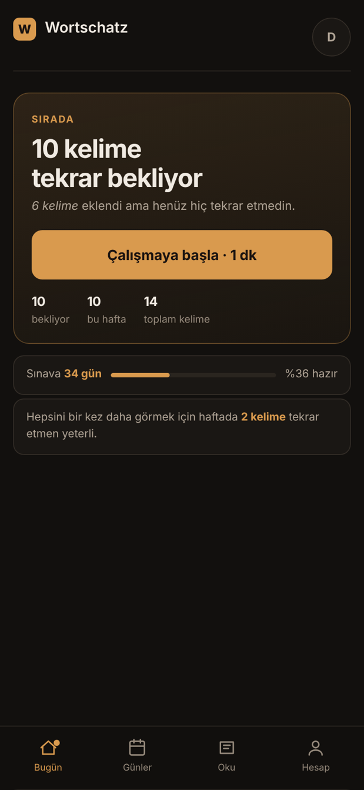
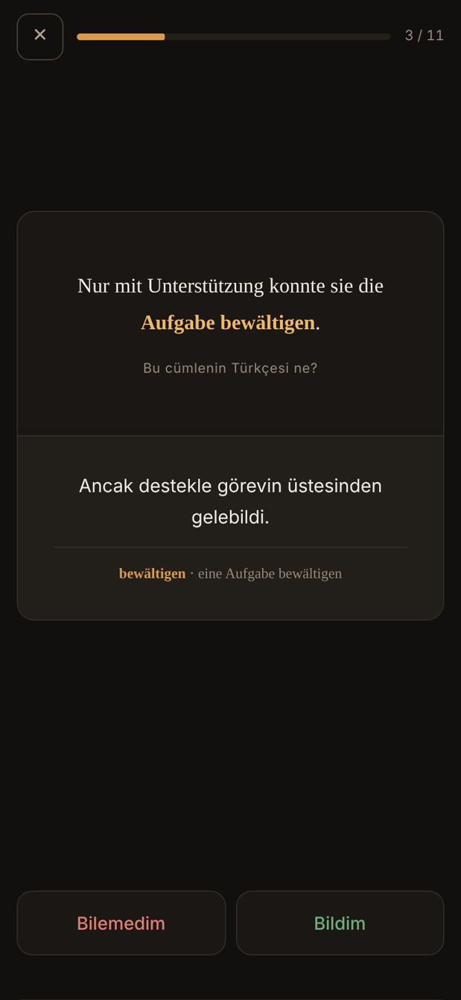
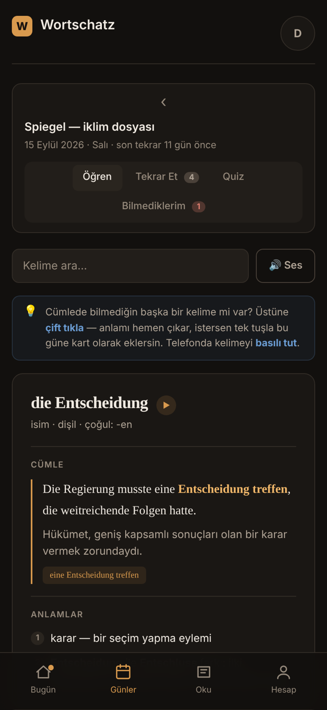
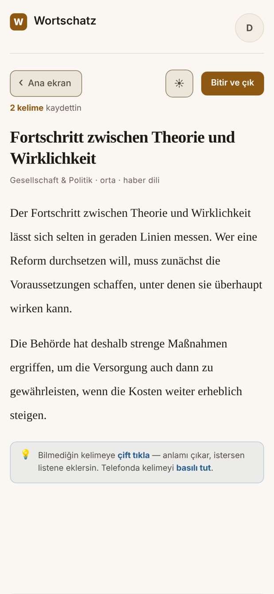

# Deniz Yarpınar

Informatics student in Germany. I build the tools I need for myself, then make them good enough for
other people to use.

---

## Wortschatz — German vocabulary trainer for Turkish speakers

<p align="center">
  
  
  
  
</p>

You paste the words you picked up while reading. The app writes a C1-level example
sentence, a Turkish translation, the collocation and two usage notes for each one — then
you study them with flashcards and quizzes.

I built it because I was learning German and kept hitting the same wall: isolated words
don't stick, but a B1 learner cannot write the sentence that would make them stick. The
app automates the part everyone skips — the content of the card.

- **Live app:** https://meinwortschatz.app
- **Source:** private — it's a product I'm preparing to launch. Happy to walk through the
  code on request.

### The idea that makes it work

Generated cards belong to the **system**, not to the user who triggered them.

```
word list ──▶ already in the shared dictionary?
                 ├── yes ──▶ attached instantly · free · no quota used
                 └── no  ──▶ generated once ──▶ written to the shared dictionary
                                                      ↓
                                           never generated again, for anyone
```

`die Entscheidung` is generated once. The second user who adds it pays nothing and waits
for nothing. **Cost per user falls as the user base grows** — which, in a subscription
product, is the whole unit economics.

Making that work needed a German stem matcher: a user typing `Entscheidungen` has to find
the `die Entscheidung` entry. It strips inflectional endings, folds umlauts, normalises
`ß↔ss` and degeminates doubled consonants — while deliberately leaving derivational
suffixes like `-ung` alone, because those change the meaning rather than the form.

### Decisions I'd defend in an interview

**Zero dependencies, no build step.** No framework, no bundler, no `node_modules`. The
frontend is one HTML file; the backend is eight serverless endpoints on Node's standard
library. Deployment is `git push`, nothing can break in a build stage, and no time goes to
dependency upgrades. The single-file frontend is now ~3,000 lines — which is also an honest
marker of where this approach starts to strain.

**Failure was designed for, not patched later.** Language models don't always answer in the
shape you asked for. Generation runs in four passes with shrinking batches and increasing
backoff; every batch that arrives is persisted immediately; words that fail are stored as
pending and can be completed later with one button. Permanent failures — exhausted credit,
filled quota — are recognised and stop the chain instead of burning four rounds. Malformed
JSON is repaired rather than discarded: the model would break its own output by using
straight quotes inside an explanation, so unescaped quotes are re-escaped and intact cards
are salvaged from truncated responses. Covered by 13 regression cases.

**The browser never touches the database.** Row-level security is on for every table with
no policies defined, so anything carrying the anon key is rejected. Passwords are `scrypt`
hashes; sessions are HMAC-signed `HttpOnly` cookies. Invite codes are claimed in a single
atomic update conditioned on `used_by IS NULL`, so two people can't redeem the same one.

**Design was measured, not argued.** I reviewed my own product against WCAG 2.2 and found
two colour tokens below threshold — including the one used for *every* helper text in the
app, at 3.24:1. Both were measured and replaced. Navigation moved to a bottom bar after
checking how much of the first screen was going to chrome instead of content: 28% on the
review screen, and not a single study day fit above the fold.

**Honest numbers over gamification.** No streaks, no badges, no points. The exam-readiness
figure was originally computed per study day, which told a learner who had just missed
three words that they were 100% ready. It's now computed per word, and freshness decays
over time. Still an estimate — but one that errs in the right direction.

### Stack

Vanilla JS · Node.js serverless on Vercel · Supabase (Postgres) over PostgREST ·
Anthropic Messages API · Resend

---

**Reach me:** yarpinardeniz@gmail.com
